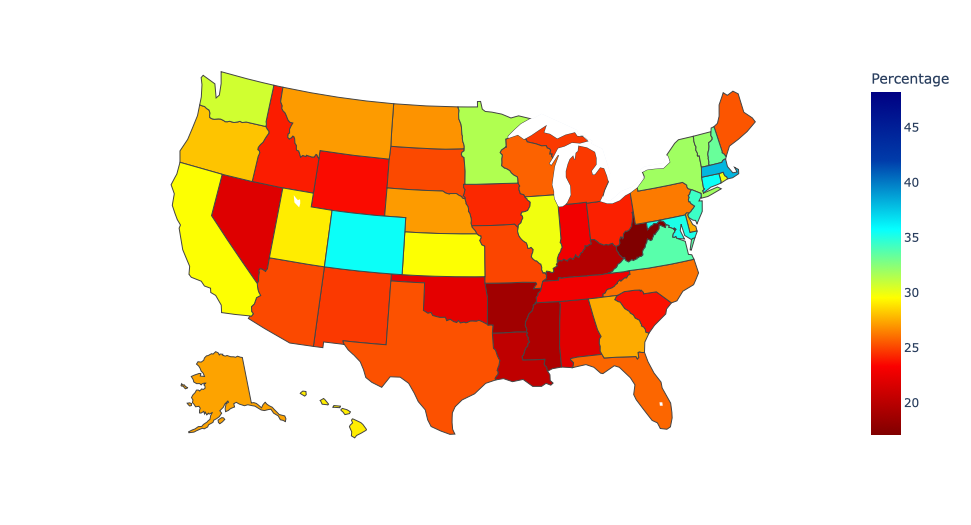
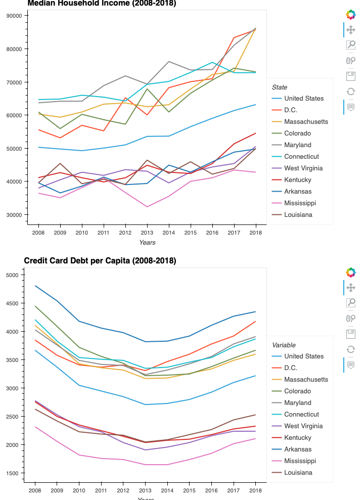
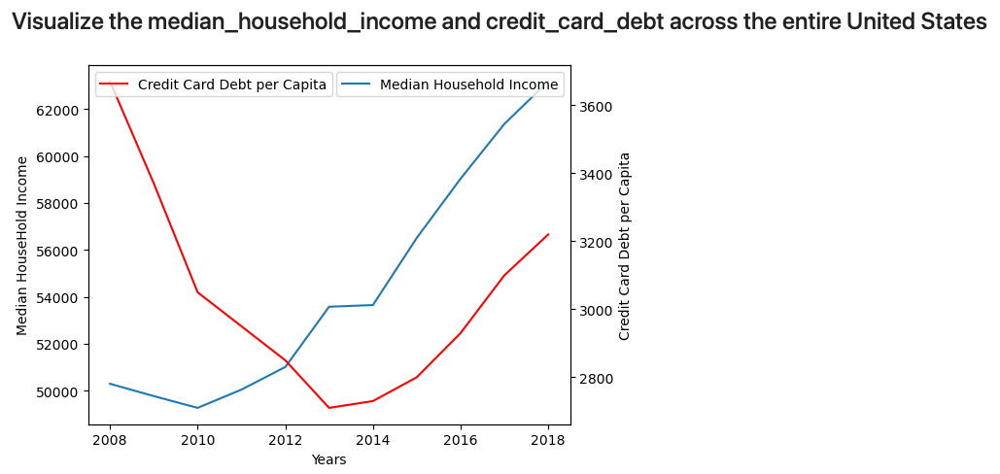
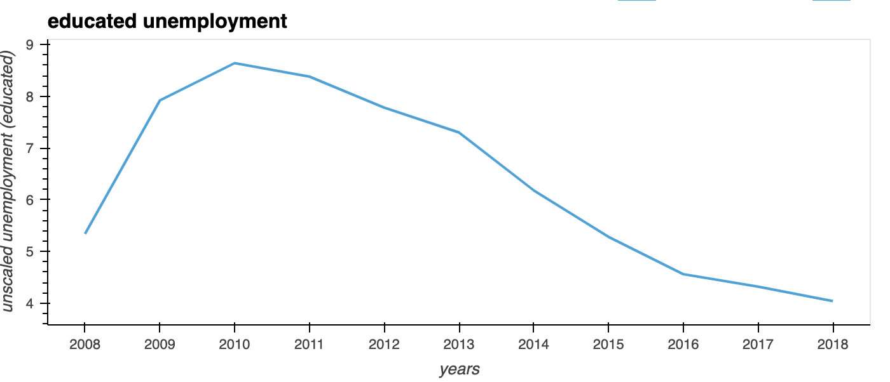
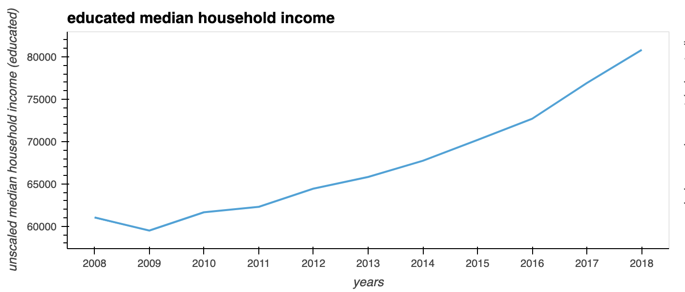
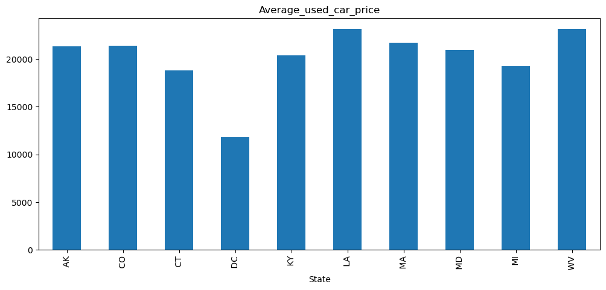

# Educational level of attainment in relation to household income

Our team chose to take a look at the ten states that were ranked both the highest and the lowest for educational attainment based on findings documented in 2008-2018. The ten states with the highest attainment were Colorado, Washington, D.C, Maryland, Connecticut, Massachusetts. The states with the lowest attainment were West Virginia, Arkansas, Mississippi, Kentucky, and Louisiana. 

For all of the states, we chose to break our analysis into several categories:

* Correlation between the average median income and the average mortgage per capita (Baha)

* Correlation between educational level, median income, unemployment, and theft crimes (Akaron)

* Credit card debt per capita vs Median household income (Marvin)

* Correlation between the median household income and unemployment rate (Vishal)

* Correlation between the average income level vs the average used car price per state (Bethel)

The results of each of the above categories analysis are listed below with accompanying screen shots. 

## Correlation between the average median incone and the average mortgage per capita

The correlation coefficient between "Average Median Income" and "Average Mortgage" is 0.953279, which is very close to 1. This means that there is a strong positive linear relationship between the two variables. As the average median income increases, the average mortgage also increases.

A correlation coefficient of 0.72823 between Median HouseHold Income 2008 and Percentage indicates a strong positive correlation. A positive correlation means that as the values of Percentage increase, the values of Median HouseHold Income 2008 also increase. The magnitude of the correlation coefficient provides information on the strength of the relationship. A correlation coefficient of 0.72823 is considered strong, but not perfect.

## Correlation between educational level, median income, unemployment, and theft crimes

The hypothesis that was started before analysis was done was that states with a lower educational have a higher incidence of theft crimes in correlation to their unemployment numbers.

The conclusion was that higher educational attained states have relatively high incidents of theft in relation to their unemployment numbers. Most of the lower educated states did not, although some did.

##  Credit card debt per capita vs Median household income

* Higher educated states do have higher levels of income and higher levels of credit card debt per capita

* The correlations between household incomes and credit card debt is relatively weak over a longer period of time across all states despite education level

* Wrong to say that higher incomes lead to a higher percentage of credit card debt relative to income

* Correlation does not imply causation.

* From 2013-2018, there was a strong positive correlation but that’s just 6 years.

* Despite the difference in education levels, there’s no clear-cut relationship between how income affects the level of credit card debt

## Correlation between the median household income and unemployment rate

* unemployment rates between 5 most educated and 5 least educated states are highly correlated and both seem pretty equally affected by the 2008 financial crisis

* strong negative correlation (-0.7 /-0.8) between median household income and unemployment rate

## Correlation between the average income level vs the average used car price per state

* States with higher median income tend to havelower used car prices and older models

* We have some dispersion across each states as far the used car prices

* States with a lower median income tend to have higher used car prices and would go with newer model

## Technologies

The following libraries were imported for our project:

* import pandas as pd

* import numpy as np 

* import seaborn as sns

* from pathlib import Path

* import hvplot.pandas

* import plotly.express as px

* import matplotlib.pyplot as plt

* import sqlalchemy

## Contributors

* Baha Amour

* Vishal Puppala

* Bethel Kameni

* Marvin Lee

* Ron Davis

## Sources for the data used in this project

https://www.newyorkfed.org/microeconomics/databank.html

https://www.kaggle.com/datasets/harikrishnareddyb/used-car-price-predictions

https://ucr.fbi.gov/crime-in-the-u.s/2019/crime-in-the-u.s.-2019/downloads/download-printable-files

https://www.icip.iastate.edu/tables/employment/unemployment-states

https://www2.census.gov/programs-surveys/cps/tables/time-series/historical-income-households/h08.xls
